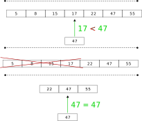

# Бинарный поиск (Binary search)

Бинарный поиск применяется для нахождения элемента в отсортированном [массиве]([[20221025215309]]). 

Рассмотрим пример. Сравним искомое число и первый элемент массива. Предположим,  мы выясняли, что искомое число меньше первого элемента массива. Так как первый элемент массива, если массив отсортирован по возрастанию, является наименьшем, то можно сразу сделать вывод, что искомого числа в массиве нет и просматривать его дальше нет смысла.


Применим ту же логику, но сравним искомое число и элемент в середине массива. Если элемент равен искомому числу, то задача решена, но если не равен и искомое число больше элемента из середины, то очевидно, что имеет смысл проверять только вторую половину массива, числа в которой больше чем взятый элемент.



Это и есть основная идея бинарного поиска — проверять не все элементы массива, а использовать отсортированность массива для сокращения количества проверок.

## Псевдокод

```
алгоритм бинарный_поиск(массив)
начало

конец
```

## Условия

Принципиальное требование для бинарного поиска — сортировка массива. Поэтому бинарный поиск невозможен в неупорядоченных коллекциях с элементами которые нельзя сравнить друг с другом. Если массив неотсортированный то можно использовать только [линейный поиск]([[20221023135032]]).

Второй важный момент — коллекция должна быть с произвольным доступом, чтобы доступ к каждому элементу требовал фиксированного количества операций независимо от размера коллекции. Если это требование не будет выполнено, то эффективность бинарного поиска будет меньше возможной.

## Сложность

Таким образом в худшем случае, придется перебрать только $log_{2}(n)$ элементов, следовательно, сложность тоже будет равна $\mathcal{O}(log_{2}(n))$. Последовательный поиск в несортированном массиве, в худшем случае, требует перебора всех элементов и его сложность $\mathcal{O}(n)$.

## Ссылки

* [@BhargavaGrokaemAlgoritmy2018, Глава 1]


