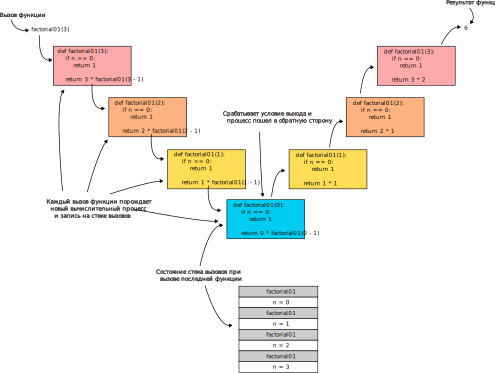

# Рекурсия (Recursion)

Рекурсия — вызов функции самой себя.

Функция может вызывать себя не напрямую, а косвенно через ряд других функций, например, функция `A` вызывает функцию `B`, а функция `B` снова вызывает функцию `A`.

Рекурсия возможна, так как каждый вызов функции порождает независимый вычислительный процесс с независимыми данными на [стеке вызовов]([[20221027000407]]).

## Части рекурсивной функции

Корректная рекурсивная функция состоит из двух частей: шага рекурсии и условия выхода. Шаг рекурсии — то полезное, что делает функциях, без него функция не имеет смысла. Условия выхода определяет момент когда рекурсивная функция завершится, без него функция будет бесконечно вызывать саму себя.

Рассмотрим функцию вычисления факториала:

```python
def factorial01(n):
    if n == 0:
        return 1

    return n * factorial01(n - 1)
```

В начале идет условие выхода (выполненное в виде [охранного выражения]([[20221023132846]]), а затем шаг рекурсии.



## Применение рекурсии

Рекурсия полезна для задач обработки данных структура которых определена рекурсивно.

## Ссылки

- [@BhargavaGrokaemAlgoritmy2018 042]
- [@BhargavaGrokaemAlgoritmy2018 043]

