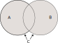

# Объединение множеств

Объединение множеств — множество включающие все элементы из объединяемых множеств.

$$
C = A \cup B\\
\Leftrightarrow \\
a \in C \Leftrightarrow a \in A \lor a \in B
$$

Даже если среди двух исходных множеств есть одинаковые элементы, в объединенном множестве все элементы будут в единственном экземпляре.

Объединение множество обладает следующими свойствами.

Коммутативность

$$
A \cup B = B \cup A 
$$
Ассоциативность

$$
(A \cup B) \cup C = A \cup (B \cup C)
$$

Свойство нуля, роль нуля выполняет [пустое множество]([[20221125204951]]).
$$
A \cup \varnothing = A
$$

## Ссылки

* [@VilenkinRasskazyMnozhestvah2005 012]
* [@VilenkinRasskazyMnozhestvah2005 016]

