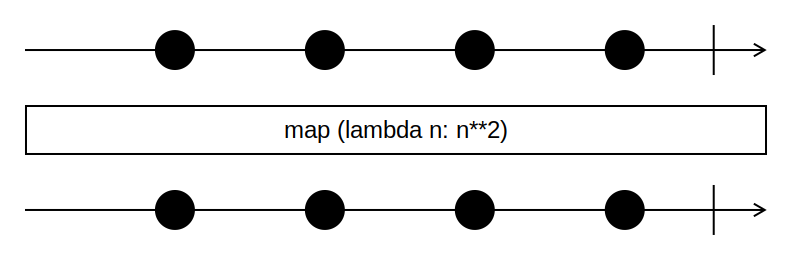

# Функция map

Функция `map` преобразует каждый элемент коллекции и возвращает эти элементы в виде новой коллекции. Количество элементов новой коллекции равно количеству элементов исходной коллекции.



Код на Python:

```python
a = [1, 2, 3, 4]
b = map(lambda   n: n ** 2, a)
print(list(b))  # [1, 4, 9, 16]
```

