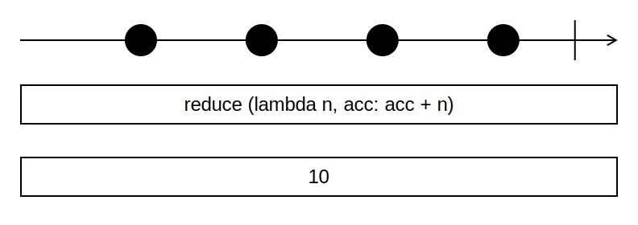

# Функция reduce

Функция `reduce` агрегирует элементы коллекции в одно значение.



Код на Python:

```python
from functools import reduce

a = [1, 2, 3, 4]
b = reduce(lambda n, acc: acc + n, a)
print(b) # 10
```

