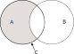

# Разность множеств

Разность множеств — множество состоящее из элементов входящих в первое множество и не входящих во второе.

$$
C = A \setminus B\\
\Leftrightarrow \\
a \in C \Leftrightarrow a \in A \land a \notin B
$$

Если множество $B \subseteq A$ то разность множеств $A \setminus B$ называют дополнением к множеству $B$ в $A$ и обозначают $B^\prime_A$. В случае рассмотрения универсального множества $I \setminus B$ может обозначаться как $B^\prime$.

## Ссылки

* [@VilenkinRasskazyMnozhestvah2005 015]
